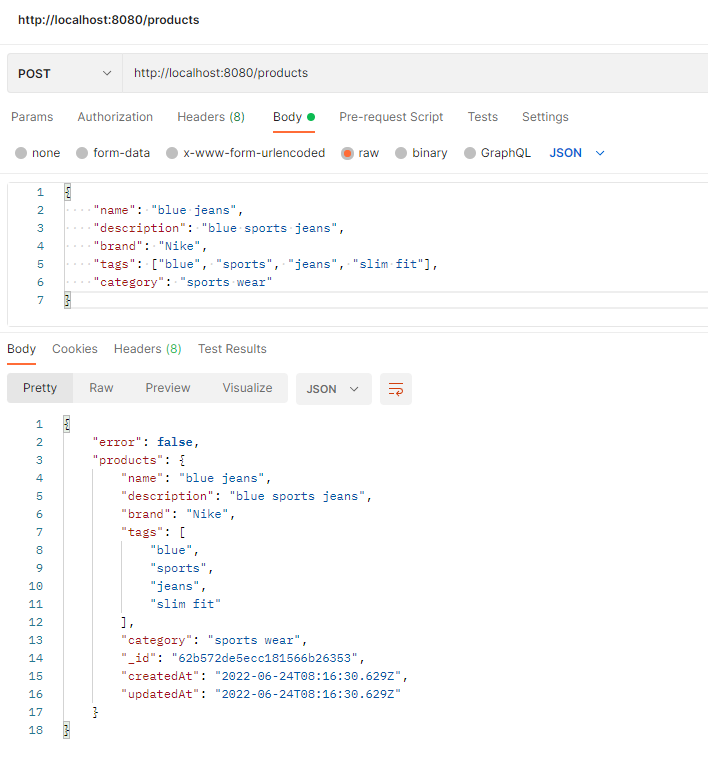
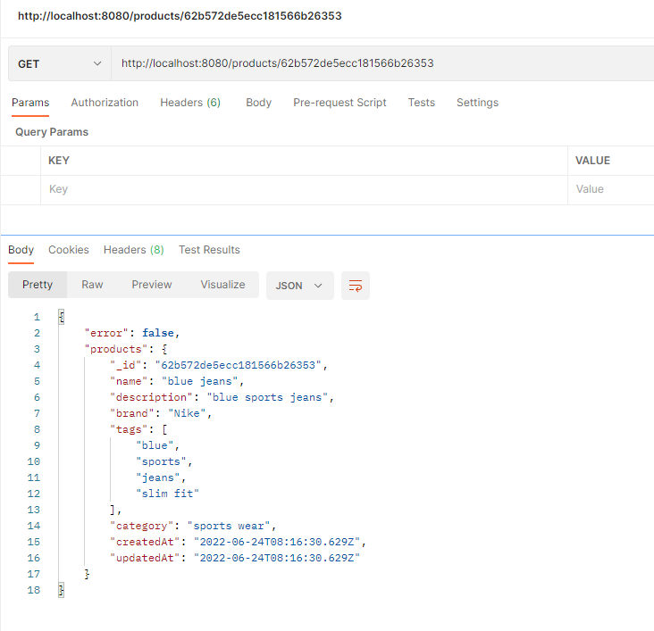
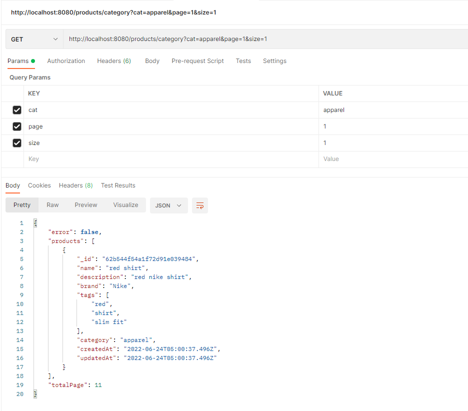
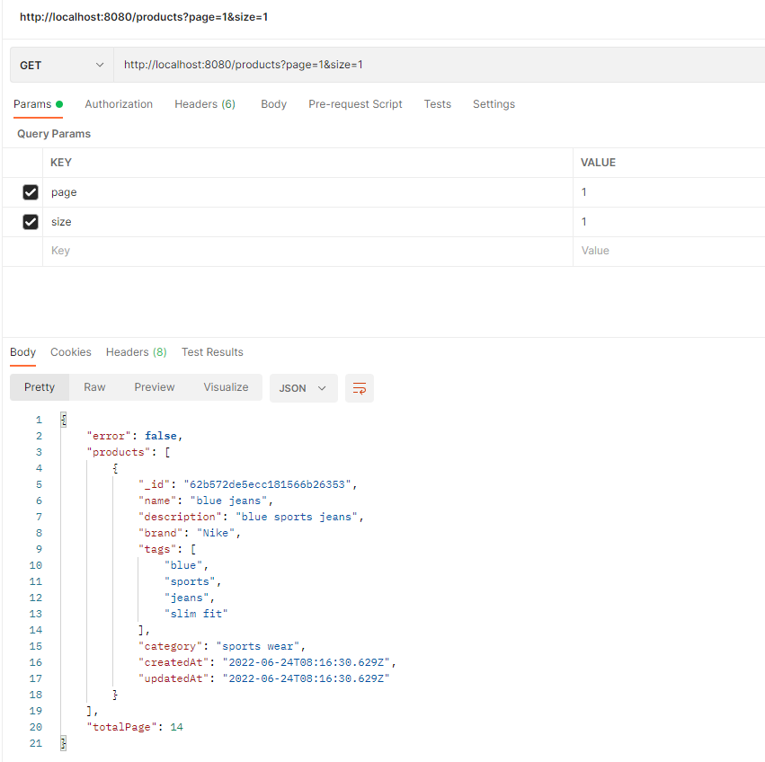
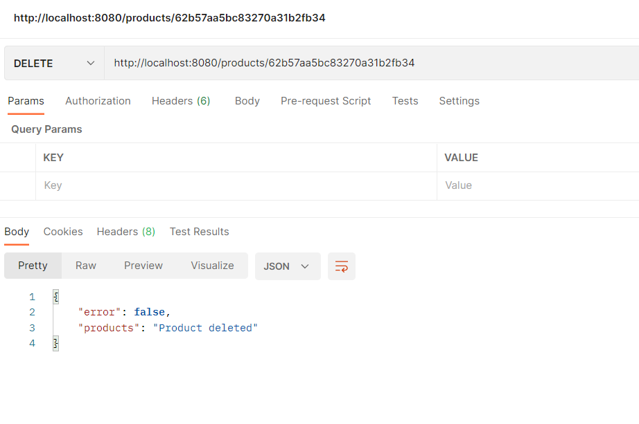

# product-api
<br />

# About the api


### This is a product api. In this api you can post data of any product of and you can get data on base categories. You can also get all data and you can get data on the base of id of product. If in case you want to delete data you can delete that data too by using id of that data. You have to clone this projuct and start api on your local server, then you can use localhost link in you your local project to check this api or you can check it on postman software. This api is works on local database.
<hr/>

## Steps to run application on local server

* Clone this repository locally than to following for starting local server for backend or frontend.
  
 * <kbd>npm start</kbd> ==> After cloning this repository you can run npm start in terminal to start server on localhost then you can try this api on local host.
 
 * <kbd>/product</kdb> ==> Add this to localhost link to get all data of product (sorted from newest to oldest) and to post data in database.
 
 * <kbd>/product/category?cat={category name}</kbd> ==> Add this to localhost link to get data according to category givent in query.4
 
 * <kbd>/product/:id</kbd> ==> Add this to localhost link to get product data of that particular id or to delete data data of particular id.
<hr/>

## TechStacks
* NodeJS
* JavaScript
* express
* Mongodb
* Mongoose
* cors
* nodemon
<hr/>

## Deployed Link

```bash
  https://deepu2560-weather-app.vercel.app/
```


# Features

* ##  Posting product data


* ##  Getting product data according to id


* ##  Getting product data according to category


* ##  Getting all product data in database


* ##  deleting product data from database


<hr />
Thank you ❤️
